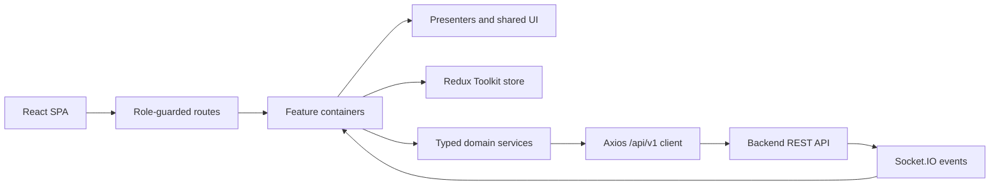
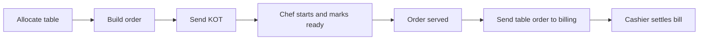

# KOT POS Frontend

A responsive restaurant point-of-sale client that connects front-of-house ordering, kitchen order tickets (KOTs), cashier billing, branch administration, and operational reporting in one role-aware React application.

> This repository contains the frontend only. It requires a compatible backend implementing the REST and Socket.IO contracts used under `src/services`.

## What it solves

Restaurant teams often coordinate table allocation, order rounds, kitchen status, and payment across separate tools. KOT POS gives each staff role a focused workflow while keeping the same orders and table state moving from waiter to kitchen to cashier.

## Key capabilities

- Dine-in table allocation, order entry, KOT submission, and billing handoff
- Takeaway order creation, kitchen submission, payment, invoice preview, and printing
- Live kitchen refreshes for new and updated KOTs
- Menu, inventory, customer, staff, settings, reporting, and AI-insight screens
- Public table QR menu, cart, checkout, and 10-second status polling
- Global branch administration and staff-to-branch assignment
- Cookie-session authentication with guarded, lazy-loaded routes
- Installable PWA shell with an offline navigation fallback

## Architecture at a glance



Feature containers own fetching and interaction logic; presenters render typed props. Redux holds cross-cutting client state, while most screen-specific forms, filters, pagination, and active carts use local React state. See [Architecture](docs/ARCHITECTURE.md), [State Management](docs/STATE-MANAGEMENT.md), and [API Integration](docs/API-INTEGRATION.md).

## Tech stack

| Area | Current implementation |
| --- | --- |
| UI | React 19, TypeScript 5.9, Tailwind CSS 4, Lucide React |
| State | Redux Toolkit, React Redux, React hooks |
| Routing | React Router 7 |
| Data | Axios, Socket.IO Client |
| Charts and QR | Chart.js, React Chart.js 2, QRCode React |
| Testing | Vitest, jsdom, Testing Library, Playwright |
| Build | Vite 7 via the `rolldown-vite` package alias |

## Roles

| Role | Frontend scope |
| --- | --- |
| `superadmin` | Global branch management only |
| `admin` | Branch administration plus waiter, kitchen, and cashier workflows |
| `manager` | Dashboard, menu, inventory, tables/orders, customers, reports, and AI insights |
| `waiter` | Tables, order entry, and order history |
| `chef` | Kitchen KOT board |
| `cashier` | Takeaway and billing workflow |

`superadmin` is not a branch `admin` and does not inherit operational routes. The exact route and action matrices are in [Authentication and RBAC](docs/AUTH-RBAC.md).

## Main workflow



The cashier also has a separate takeaway flow that creates an order, sends its KOT, and collects payment. Public QR guests can place a table order without a staff session and then poll its status.

## Major features

- **Operations:** tables, multi-round dine-in ordering, order history, kitchen status actions, takeaway, bills, GST invoice display, and receipt printing.
- **Branch administration:** dashboard, menu, inventory and stock history, customers, staff, reports, settings, and AI-backed insight views.
- **Global administration:** create, edit, activate/deactivate, summarize, and assign staff to branches.
- **Feedback:** reusable loading, empty, error, pagination, modal, form, and toast components; a top-level React error boundary.
- **Realtime:** authenticated role-room Socket.IO connection with event-driven refreshes and generated Web Audio cues.
- **PWA:** manifest, service worker, install prompt support, static asset caching, and an offline document fallback. Live API operations still require a network connection.

## Project structure

```text
src/
|-- charts/             Dashboard and report charts
|-- components/ui/      Reusable UI primitives
|-- config/             Endpoints and centralized permissions
|-- contexts/           Toast provider
|-- design-system/      Header and sidebar application shell
|-- errorBoundary/      Top-level render error fallback
|-- features/           Auth, admin, waiter, chef, cashier, and QR modules
|-- hooks/              Notifications, printing, PWA, and utility hooks
|-- routing/            Route table, guards, and role redirects
|-- services/           Axios client and domain API modules
|-- state/              Redux store, typed hooks, and slices
|-- __tests__/          Vitest suites and test setup
e2e/                    Playwright setup and browser scenarios
public/                 Manifest, service worker, icons, and offline page
docs/                   Technical documentation
```

## Authentication, RBAC, and branch isolation

On startup, the app calls `/auth/me`; login posts to `/auth/login`. The browser sends session cookies with authenticated REST and Socket.IO traffic. Redux stores user metadata, not an access token. On an eligible `401`, one refresh request runs while concurrent failures wait, and a failed refresh returns the browser to `/login`.

Routes and selected UI actions are checked against centralized role lists. These client checks are navigation controls, not a security boundary; the backend must authorize every request.

Branch staff carry a `branchId` in the authenticated user object, but the frontend does not add a branch ID to operational requests. The superadmin sidebar selector only records which branch label is selected; it does not change API scope. See [Authentication and RBAC](docs/AUTH-RBAC.md) and [API Integration](docs/API-INTEGRATION.md).

## Realtime behavior

After authentication, one Socket.IO singleton connects to `VITE_API_URL`, sends cookies, and emits `join:room` with the current role. It publishes `order:new`, `kot:updated`, `table:updated`, and `billing:created` to React subscribers. Kitchen, tables, and bills respond by refetching current REST data. Public QR order status uses polling rather than Socket.IO. Details: [Realtime](docs/REALTIME.md).

## Local setup

Requirements: Node.js 20 or a compatible current Node.js release, npm, and a compatible backend.

```bash
npm ci
copy .env.example .env
npm run dev
```

In PowerShell, `Copy-Item .env.example .env` is equivalent. Vite uses `http://localhost:5173` by default.

## Environment variables

| Variable | Used by | Purpose |
| --- | --- | --- |
| `VITE_API_URL` | Browser app | Backend origin only; do not include `/api/v1` |
| `E2E_ADMIN_USERNAME` / `E2E_ADMIN_PASSWORD` | Playwright | Seeded admin account |
| `E2E_MANAGER_USERNAME` / `E2E_MANAGER_PASSWORD` | Playwright | Seeded manager account |
| `E2E_WAITER_USERNAME` / `E2E_WAITER_PASSWORD` | Playwright | Seeded waiter account |
| `E2E_CHEF_USERNAME` / `E2E_CHEF_PASSWORD` | Playwright | Seeded chef account |
| `E2E_CASHIER_USERNAME` / `E2E_CASHIER_PASSWORD` | Playwright | Seeded cashier account |

Values prefixed with `VITE_` are compiled into browser assets and must never contain secrets. Playwright credentials belong in the launching environment or CI secrets; the configuration does not load `.env` itself.

## Development scripts

| Command | Purpose |
| --- | --- |
| `npm run dev` | Start the Vite development server |
| `npm run build` | Create the production bundle in `dist/` |
| `npm run preview` | Preview the production bundle locally |
| `npm run typecheck` | Run TypeScript project checks without emit |
| `npm run lint` | Run ESLint across the repository |
| `npm test` | Run Vitest once |
| `npm run test:watch` | Run Vitest in watch mode |
| `npm run e2e` | Run Playwright setup and Chromium tests |
| `npm run e2e:ui` | Open Playwright UI mode |
| `npm run e2e:debug` | Start Playwright debug mode |
| `npm run e2e:headed` | Run Playwright headed |
| `npm run e2e:report` | Open the last HTML report |

## Testing

Unit and component tests run in jsdom with Vitest and Testing Library. Playwright starts or reuses the Vite server, creates saved sessions for five branch roles, and runs Chromium scenarios against a compatible seeded backend. Full commands, coverage configuration, and CI behavior are in [Testing](docs/TESTING.md).

## Production build and deployment

```bash
npm run typecheck
npm run lint
npm test
npm run build
npm run preview
```

The deployable static output is `dist/`. The checked-in `vercel.json` rewrites all routes to `index.html` for client-side routing. No Docker, Netlify, or backend deployment configuration is present. See [Deployment](docs/DEPLOYMENT.md).

## Live demo

The workspace-level [Demo Guide](../docs/DEMO-GUIDE.md) contains the live-URL placeholder, safe seeded usernames, walkthrough order, and environment warnings.

## Demo credentials

Use the role accounts in the workspace-level [Demo Guide](../docs/DEMO-GUIDE.md). The effective demo password is intentionally supplied separately; never commit production credentials or the seed password.

## Screenshots

> **Placeholder:** add representative dashboard, waiter order, kitchen board, cashier, and QR-ordering screenshots under `docs/screenshots/`.

## Related backend repository

> **Placeholder:** add the compatible KOT POS backend repository URL here.

## Known limitations

- The frontend cannot operate independently of the compatible backend and does not define the backend contract or seed data.
- Client-side RBAC must be duplicated and enforced by the backend.
- The superadmin branch selector is visual state only and does not scope operational requests.
- Realtime events trigger REST refetches; they do not maintain a normalized live entity cache.
- QR order tracking polls every 10 seconds and silently ignores polling failures.
- Offline support covers navigation fallback and cached static assets, not API-backed POS operations.
- This frontend repository has no deployed URL or screenshots. Workspace-level demo documentation provides seeded usernames but intentionally does not contain the effective password.
- No `test:coverage` package script is defined, although Vitest contains coverage settings.

## Technical documentation

- [Project system design](../docs/SYSTEM-DESIGN.md)
- [Project data flows](../docs/DATA-FLOW.md)
- [Project roles and permissions](../docs/ROLE-PERMISSIONS.md)
- [Recruiter demo guide](../docs/DEMO-GUIDE.md)
- [Architecture](docs/ARCHITECTURE.md)
- [Authentication and RBAC](docs/AUTH-RBAC.md)
- [State Management](docs/STATE-MANAGEMENT.md)
- [API Integration](docs/API-INTEGRATION.md)
- [Realtime](docs/REALTIME.md)
- [Testing](docs/TESTING.md)
- [Deployment](docs/DEPLOYMENT.md)

Licensed under the terms in [LICENSE](LICENSE). See also [CONTRIBUTING.md](CONTRIBUTING.md), [SECURITY.md](SECURITY.md), and [CHANGELOG.md](CHANGELOG.md).
