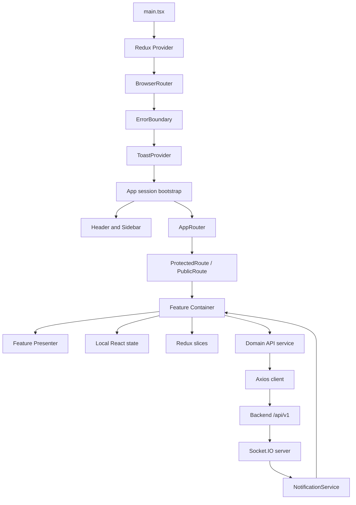
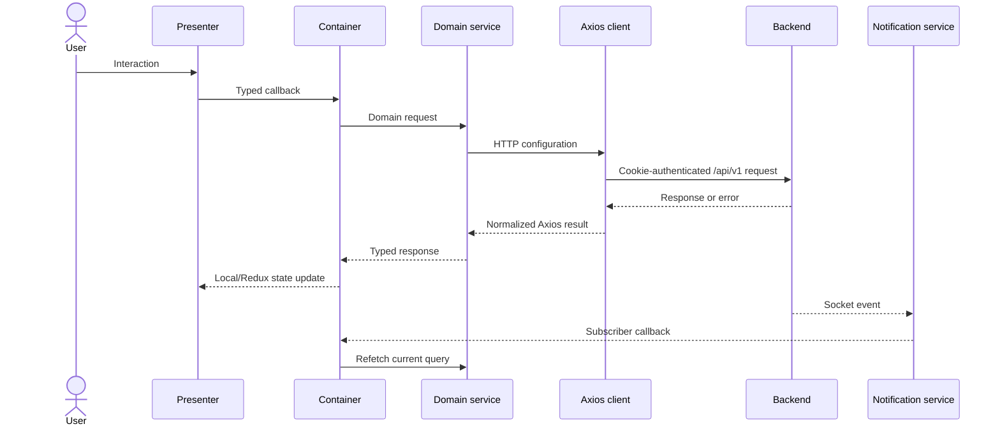

# Frontend Architecture

This document describes the architecture visible in the current frontend. Backend internals are outside this repository.

## Runtime composition

`src/main.tsx` mounts the app in React `StrictMode` and composes the Redux provider, browser router, top-level error boundary, and toast provider. `App.tsx` restores the cookie session, connects or disconnects realtime notifications, and chooses between the authenticated header/sidebar shell and the public route surface.

## Routing

`src/routing/AppRouter.tsx` defines all routes. Authentication pages are imported eagerly; feature pages are loaded with `React.lazy` under one `Suspense` fallback.

- `/` redirects to the authenticated user's role home or `/login`.
- `/login`, `/signin`, `/signup`, and `/menu/:tableId` are wrapped in `PublicRoute`.
- Operational and administrative routes use `ProtectedRoute` with role lists from `src/config/permissions.ts`.
- An unauthenticated protected request redirects to `/login` and preserves the attempted location in router state.
- An authenticated user without permission is redirected to their role home.
- Authenticated users are redirected away from every `PublicRoute`, including the public QR menu.
- Unmatched paths render `NotFoundPage`.

The exact access matrix is maintained in [Authentication and RBAC](AUTH-RBAC.md).

## Feature modules and container/presenter split

`src/features` is organized by role/domain: `auth`, `admin`, `waiter`, `chef`, `cashier`, and `qrCode`. Larger screens normally have:

- `*Container.tsx`: requests, local state, effects, validation, derived values, and event handlers.
- `*Presenter.tsx`: render-focused component driven by typed props.
- `*.types.ts`: screen-level models and prop contracts.

This convention is prevalent, not enforced by tooling. Containers still contain some rendering and direct service calls, and presenters may contain UI behavior.

## State ownership

Redux Toolkit contains `auth`, `cart`, and `ui` reducers. Authentication is the primary Redux-backed runtime flow. Most feature state—including server lists, filters, pagination, modal visibility, and the active waiter/cashier/QR carts—lives in component hooks. There is no normalized global server cache and no query library. See [State Management](STATE-MANAGEMENT.md).

## API layer

`src/services/apiClient.ts` exports the shared authenticated Axios instance. Domain modules under `src/services/admin`, `cashier`, `chef`, and `waiter` define typed endpoint functions. The QR menu has a separate unauthenticated Axios instance, and signup also uses direct Axios. See [API Integration](API-INTEGRATION.md).

## Design system

The visual layer consists of:

- Tailwind CSS 4 integrated through the Vite plugin.
- Theme variables and global rules in `src/index.css`.
- reusable primitives in `src/components/ui`, including buttons, inputs, cards, tables, modals, status badges, pagination, loading, empty, and error states;
- application-shell organisms (`Header` and `Sidebar`) under `src/design-system/organisms`;
- Lucide icons, Chart.js charts, and QRCode React output.

The repository does not include Storybook or a separately versioned design-system package.

## Realtime

`notificationService` is a singleton Socket.IO adapter. `App` ties its connection lifecycle to authentication. `useNotifications` bridges its publisher API into components. Events do not directly mutate Redux; current screens respond by refetching relevant REST collections. See [Realtime](REALTIME.md).

## Error handling

Error handling is layered:

- `ErrorBoundary` catches render-tree errors, logs them, and shows retry/home actions.
- The Axios response interceptor coordinates eligible `401` refreshes, queues `429` retries, shows rate-limit toasts, and logs `500` errors.
- Feature containers catch request failures and usually show toast messages or inline list errors derived from `response.data.error` with local fallbacks.
- Abort controllers prevent stale list requests from updating state in several paginated features.
- Some optional/background requests intentionally fail silently, such as QR status polling and selected sidebar branch-name lookup.

There is no external error-reporting integration in the repository.

## Data flow

## PWA boundary

The manifest and service worker live in `public/` and are registered from `index.html`. The worker precaches `/` and `/offline.html`, caches static assets on first use, uses network-first navigation with an offline fallback, skips non-GET requests, and bypasses same-origin paths beginning `/api/`. It is an installable shell, not an offline transactional POS.
