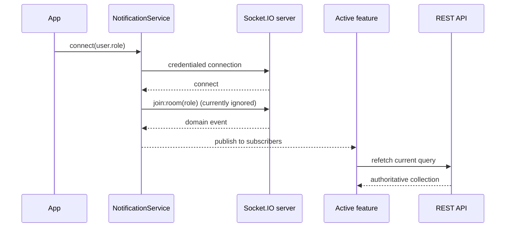

# Realtime Behavior

## Connection lifecycle

`src/services/notificationService.ts` exports one Socket.IO singleton. `App.tsx` calls `connect(user.role)` when a Redux-authenticated user exists and `disconnect()` otherwise.

The client connects to `VITE_API_URL` (or the module's hosted fallback) with:

- `withCredentials: true`;
- transports ordered as polling, then WebSocket;
- 10 reconnection attempts;
- a 2-second reconnection delay.

When connected, it emits `join:room` with the role string. The current backend does not listen for that event because it already assigns the room during the authenticated handshake. The frontend does not include a branch ID. Connecting again with the same role while already connected is ignored; changing role disconnects the previous socket first.

## Events

| Incoming event | Typed payload | Service side effect | Current screen behavior |
| --- | --- | --- | --- |
| `order:new` | KOT/order summary | New-order sound | Kitchen refetches its active query |
| `kot:updated` | KOT/order summary | Preparing, ready, or cancelled sound by status | Kitchen refetches its active query |
| `table:updated` | Table summary | None | Tables screen refetches tables |
| `billing:created` | Bill summary | Billing sound | Billing screen refetches when its Bills tab is active |
| `room:joined` | Client expects `{ room }`; backend sends `{ role, branchId }` | None | Published with `room: undefined` in the current integration |
| `connect` | None | Tracks connected state | Kitchen can display connection state |
| `disconnect` | Reason | Tracks disconnected state | Kitchen can display connection state |

Sounds are synthesized with the Web Audio API; no audio files are loaded. Audio failures (for example, browser focus/autoplay restrictions) are silently ignored.

The `room:joined` payload mismatch does not affect authorization or room membership: the backend has already joined the server-derived room. It only makes the optional client acknowledgement payload inaccurate until the client type/handler is aligned.

## React subscription bridge

`useNotifications` subscribes once to every supported event, keeps the latest handler map in a ref, and returns current connection state. Its cleanup functions remove callbacks from the service's subscriber sets. Subscriber exceptions are caught and logged so one callback does not stop the others.

The service clears all subscribers on disconnect. Components normally unmount when authentication is lost, then subscribe again when remounted.

## Data consistency model

Socket payloads are signals, not the frontend's persistent data store. Kitchen, table, and billing handlers refetch via REST rather than merging payloads into Redux. This preserves the REST response as the screen-level source of truth but can add network traffic during event bursts.

## Failure and fallback behavior

- Socket connection errors are logged to the console.
- Socket.IO performs the configured reconnection attempts; the frontend provides no manual global reconnect control.
- Existing REST screens still support their normal initial loads and manual refresh behavior when realtime is unavailable.
- Public QR order tracking does not use the socket. It polls its status endpoint every 10 seconds and silently keeps the last known state on an error.

## Scope limitation

The client requests a role room only. Branch-specific routing, authorization, and event filtering must therefore be enforced by the compatible Socket.IO backend; those backend guarantees cannot be verified from this frontend repository.
